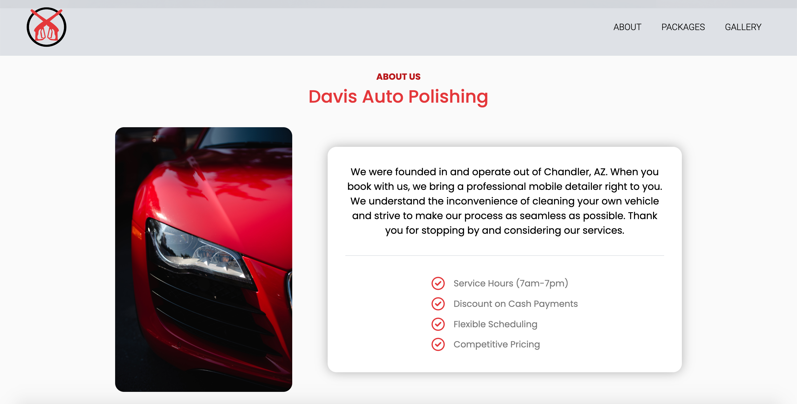
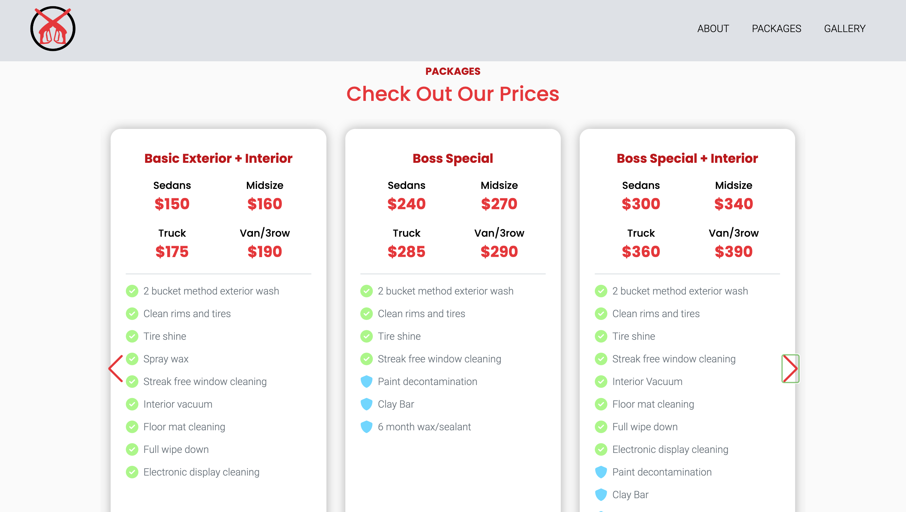
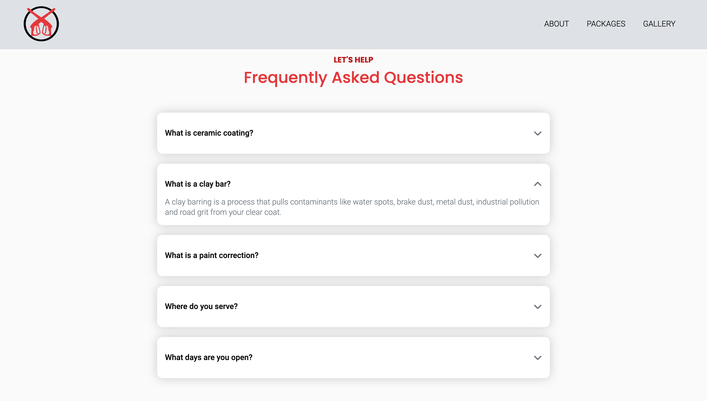

# Davis Auto Polishing

### Links:
[demo](https://davisautopolishing.com)
[repo](https://github.com/loganveik/davisautopolishing)

### Description:
Website I was hired to build for a client in Arizona who owns a Car Detailing business. Consulted with client about design, development, and SEO needs.

### Technologies Used:
HTML5, CSS3, Javascript, jQuery

### How to Use:
1) Hero

2) About

3) Package Plans

4) FAQ
